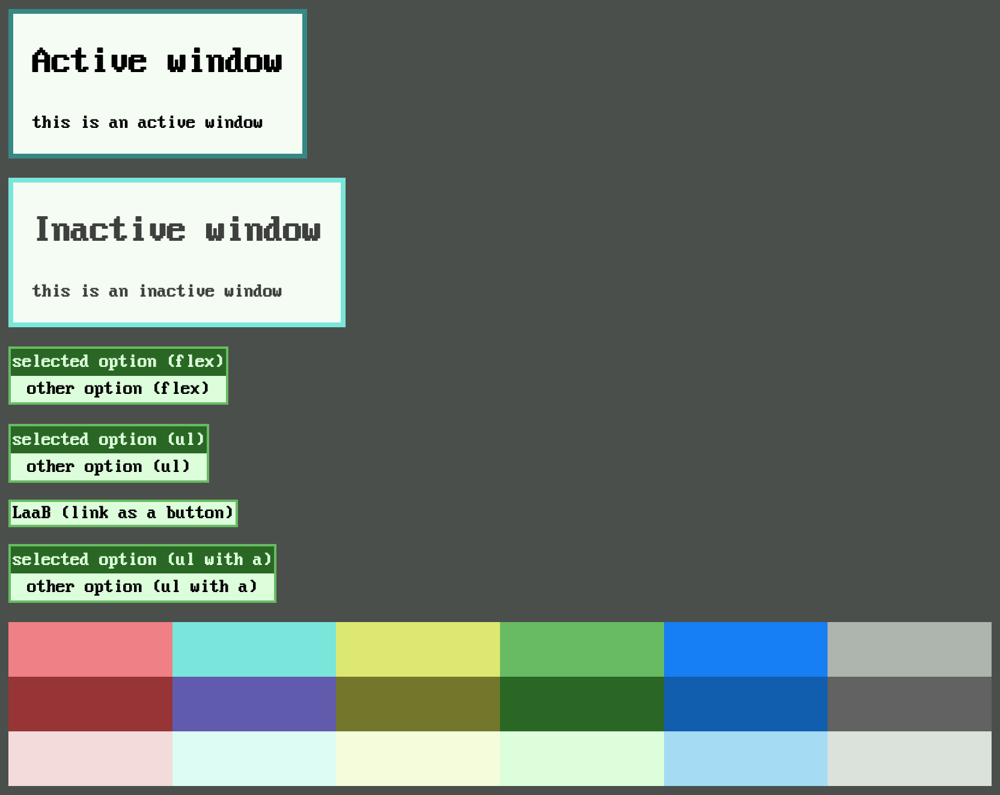

# 9ui

A single stylesheet in pure CSS for Plan 9-like user interfaces.

## Overview

There is only one stylesheet file: [9ui.css](./9ui.css), which defines fonts, classes, and variables only. In this way, the user can freely decide how their DOM elements bind with the relative Plan 9 UI elements, without imposing the usage of some HTML tags rather than others. The stylesheet is made to be as simple as possible.

For now the available UI elements, as CSS classes, are:

- `active-window` and `inactive-window`, which are suitable for simple containers.
- `menu`, which displays options, optionally clickable, and is suitable for navbars and lists of links. A selected option can be marked as such by using `menu-sel`. An option is also displayed as selected if the user holds the cursor over it.
- `button`, which is displayed like `menu` but with a single option. In this case, there is no such thing as a "selected button", but holding the cursor over it produces the same effect as options in `menu`.

The available colors, as CSS variables, are in the following form: `--` + name of the color + `-` + `primary` or `secondary` or `background` (as a regular expression: `--[a-z]-(primary|secondary|background)`). The colors come from the default [stats(8)](http://man.9front.org/8/stats) configuration got right after booting. Of each graph:

- `primary` is the main color of the graph (invisible when 0%)
- `secondary` is the color of the line on top of the graph
- `background` is the color outside of the graph (invisible when 100%)

You can see a preview, which works as a usage example as well, using [preview.html](./preview.html).

## License

ISC (see [LICENSE](./LICENSE))

## Credits

- [VileR](https://int10h.org): IBM VGA font ([license](https://int10h.org/oldschool-pc-fonts/readme/#legal_stuff)).
